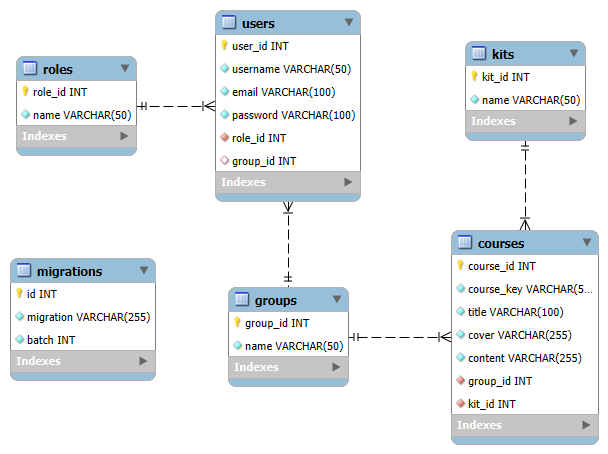

## Actividad 7 y Tarea 6

## Nombre: Manejador de cursos de Robotica

# Descripción: 

Este proyecto esta desarollado con Laravel, 
por el cual se realiza la población de una Base de Datos.
Por medio de Xampp se accede a phpMyAdmin (en formato MySQL),
para visualizar la Base de Datos poblada por los Seeders.

Este proyecto forma parte de dos actividades académicas

El siguiente diagrama representa la estructura de la base de datos utilizada en el proyecto:

## Diagrama ER

